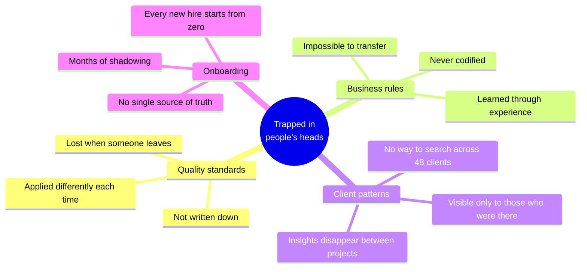
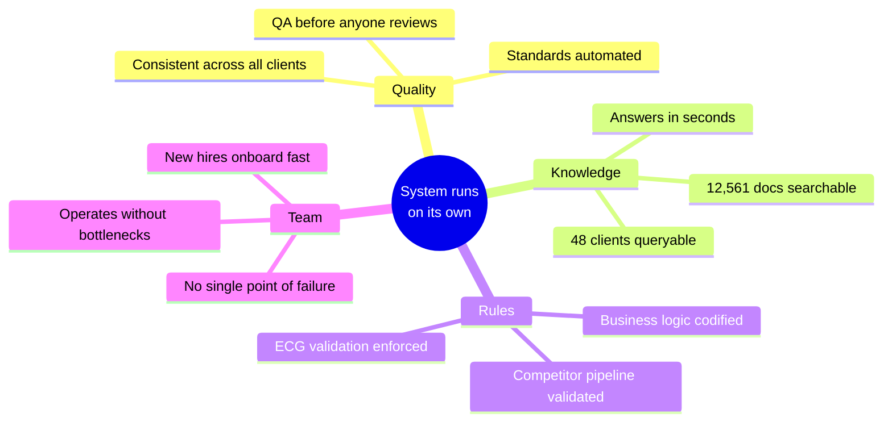

# Growth Signal Intelligence Program

**An 8-week hands-on program to turn institutional knowledge into a queryable intelligence layer.**

Force of Nature × Growth Signal | February 2026

---

## The Problem

Right now, Growth Signal's quality depends on you being in the room. Business rules live in your head. Quality standards are applied when you review. Cross-client patterns exist only when you connect the dots manually.

That means you spend your time **operating** — reviewing, correcting, checking — instead of doing what only you can do: thinking about the future, designing new products, building the next thing.

The goal isn't to make you faster. The goal is to **free you entirely** — so that nothing falls apart when you're not looking, and you can focus on what matters most.

## The Solution

An intelligence layer that belongs to the company — not to any one person. Built entirely on Growth Signal's existing Notion workspaces, internal documentation, and operational data.

The business rules live in the system. The quality standards live in the system. The knowledge lives in the system. It doesn't depend on any one person. It belongs to the company.

> **All data comes from Force of Nature's Notion workspaces and Growth Signal's internal systems.** Client reports, strategy documents, QA frameworks, operational playbooks, and product data — structured, indexed, and made queryable.

The goal is a system that runs whether we're in the room or not.

The knowledge exists. The problem is where it lives:

None of this is anyone's fault. It's how every company works — until you build the system that captures it. That's what this program does. Safely, gradually, with you in control of every decision.

---

## What You'll Build

You teach the system your rules. You define the standards. You decide what gets automated and what stays manual. Everything the system does, it does because you designed it that way.

The repetitive work — the reviewing, the checking, the "did anyone follow the rules?" — that runs on its own. The system doesn't need us. Our time goes back to building what's next.

---

## Program — 8 Tuesdays

Every Tuesday. 60 minutes. You build everything yourself.

Every session: **Build → Test → Approve → Advance.** Nothing moves forward unless you approve it. If something doesn't feel right, we fix it and test again. The system only contains what you trust.

The recipe gets shorter as you go:

| Week | Theme | You Build | Recipe |
|------|-------|-----------|--------|
| 1 | First Contact | Business rules + AI-generated brief in Notion | Full recipe |
| 2 | Pattern Recognition | Cross-client insights across 48 clients | Full recipe |
| 3 | Quality Control | Quality standards codified + QA workflow | Less detail |
| 4 | Competitor Intelligence | Competitor pipeline rules v1 | Less detail |
| 5 | Workflow Design | One complete AI workflow for your team | Ingredients only |
| 6 | Team Enablement | Starter kit for your team to use AI | Ingredients only |
| 7 | Strategic Analysis | AI-generated strategic brief for a real client | No recipe |
| 8 | Integration | Complete AI playbook for Growth Signal | No recipe |

Full details in [`program/`](program/).

---

## After 8 Tuesdays

| Today | Week 8 |
|-------|--------|
| You review every report | Reports QA'd before anyone sees them |
| Rules live in your head | Rules in the system, applied every time |
| New hire shadows you for months | New hire queries the knowledge base on day 1 |
| You go on vacation = things break | You go on vacation = nothing changes |
| 48 clients, zero cross-visibility | 48 clients, one question, five seconds |

---

*Nani Pisano | February 2026*
