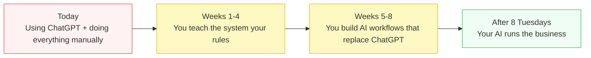

# Growth Signal Intelligence Program

**8 weeks. 8 Tuesdays. You build an AI that knows your business better than ChatGPT.**

Force of Nature × Growth Signal | February 2026



---

## The problem

You're trapped in two ways. First, everything runs through you — quality standards, business rules, client patterns, what works, what doesn't. Your team can't operate without you. New hires can't learn without shadowing you for months.

Second, you're trapped in ChatGPT. You spend hours prompting, editing, and correcting generic AI that doesn't know your clients, doesn't understand your rules, can't access your 48 clients of data. You're using AI that should already know what you know.

You're not slow. You're trapped. Trapped doing operational work manually, and trapped using AI that doesn't know your business.

Your #1 mission: build something better than ChatGPT. An AI that knows your clients, applies your rules, and works with your data.

```
today:
    quality depends on       → you being in the room
    rules are applied when   → you remember to check
    patterns are visible to  → only you
    new hire gets up to speed → after months of shadowing you
    you go on vacation       → things break
    AI answers               → ChatGPT doesn't know your clients or rules
```

The goal isn't to make you faster. The goal is to build an AI that makes you unnecessary for the operational work so you can focus on what only you can do.

---

## The solution

You build an AI that knows your business. Not a document. Not a wiki nobody reads. An intelligence layer that applies your rules automatically, answers questions across 48 clients in seconds, and replaces ChatGPT with something that actually knows your clients.

```
after 8 tuesdays:
    quality depends on       → your AI, not any one person
    rules are applied        → automatically, every time
    patterns are visible to  → anyone who asks
    new hire gets up to speed → by querying your AI on day 1
    you go on vacation       → nothing changes
    AI answers               → your AI knows your clients, rules, and data
```

You decide what your AI knows. You decide what it automates. You approve everything before it becomes part of the system. Nothing moves without your OK.

> **Where does your AI learn from?** Your Notion workspaces. Your internal documents. Your operational data. Not the internet. Not generic training data. Everything your AI knows, it knows because it's already in your systems — just structured, indexed, and made queryable.

None of this is anyone's fault. Every company works this way until someone builds the AI that captures their knowledge. That's what we're doing here. Safely. Gradually. With you in control.

---

## What you'll build

```
for each rule you know:
    you teach it to your AI once
    your AI applies it across all clients
    the team uses it without asking
    new hires learn it without shadowing you

for each process you repeat:
    you map it: input → steps → output
    you automate it with your AI
    it runs on its own from that moment on

result:
    your AI replaces ChatGPT
    your AI runs the operational work
    your time goes back to strategy, vision, and building what's next
```

---

## How every session works

Every Tuesday. 60 minutes. You build your AI yourself.

```
every session:
    build     → you teach your AI something new, using your data
    test      → you test it against live data, see the results
    approve   → you review the output, you decide what stays
    advance   → approved knowledge goes into your AI

    if something feels wrong:
        we stop
        we fix it
        we test again
        you decide

    nothing goes into your AI without your OK
    your AI only grows with what you trust
```

---

## 8 weeks — the recipe gets shorter

| Week | What you build for your AI | How much guidance |
|------|---------------------------|-------------------|
| **1** | Business rules + AI-generated brief in Notion | Full recipe |
| **2** | Cross-client insights across 48 clients | Full recipe |
| **3** | Quality standards codified + QA workflow | Less detail |
| **4** | Competitor pipeline rules v1 | Less detail |
| **5** | One complete AI workflow for your team | Ingredients only |
| **6** | Starter kit for the team to use your AI | Ingredients only |
| **7** | AI-generated strategic brief for a real client | You decide |
| **8** | Complete AI playbook that replaces ChatGPT | You decide |

Weeks 1–2: you get the full recipe and all the ingredients. Weeks 3–4: you get the ingredients and the key steps. Weeks 5–6: we get the goal and the tools. Weeks 7–8: you choose the goal, you pick the tools, you build it.

Full details in [`program/`](program/).

---

## After 8 Tuesdays

```
your AI:
    applies your rules         → across all clients, every time
    enforces your standards    → without anyone reviewing manually
    answers questions          → across 48 clients, in seconds
    onboards new hires         → on day 1, not after months
    replaces ChatGPT           → knows your business, not generic
    runs                       → whether we're in the room or not

you:
    stop using ChatGPT         → start using your AI
    stop operating manually    → start designing AI solutions
    stop being the bottleneck  → start being the architect
```

---

*Nani Pisano | February 2026*
